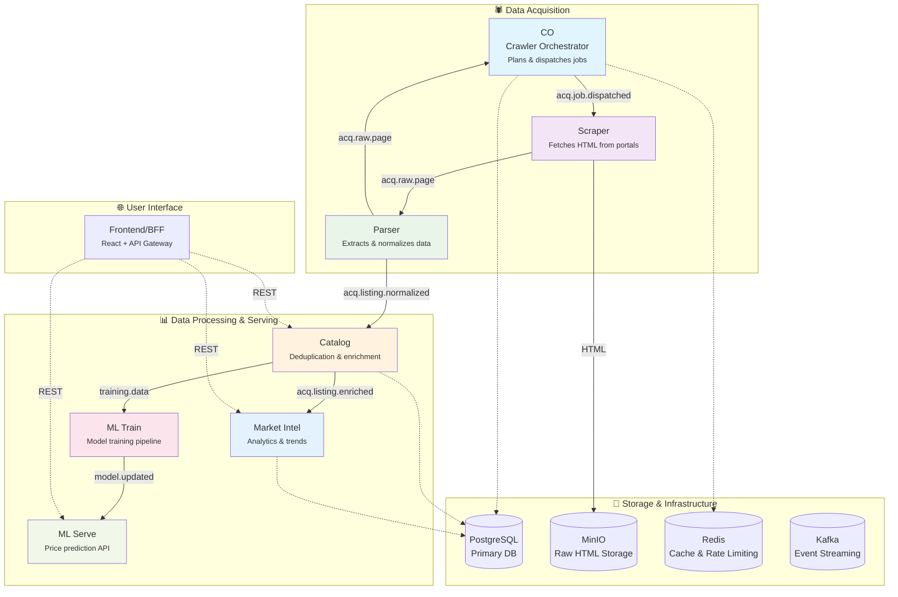

# Property & Rental Price Tracker

A distributed real estate data acquisition, processing, and intelligence platform built with microservices architecture. Automatically crawls property portals, normalizes listings data, and provides market insights with ML-powered price predictions.

## System Overview

The platform follows an event-driven architecture with specialized services handling different aspects of the data pipeline, from initial crawling to serving market intelligence.



## Services Architecture

### 🧠 CO — Crawler Orchestrator *(Spring Boot)*
**The brain of ingestion.** Plans what to crawl, when, and how fast.

**Responsibilities:**
- Maintain crawler frontier (URLs + priority + scheduling)
- Enforce per-portal rate limits & concurrency controls
- Dispatch crawl jobs to Kafka using Outbox pattern
- Reschedule jobs based on crawl results
- Provide REST API for URL management and portal policies

**Key Features:**
- Redis token bucket rate limiting
- Leader election for single dispatcher
- Smart adaptive scheduling
- Portal-specific crawling policies

---

### 🕷️ Scraper *(Python/Scrapy or Node.js)*
**The fetcher.** Downloads HTML content from real estate portals.

**Responsibilities:**
- Consume crawl jobs from Kafka (`acq.job.dispatched`)
- Fetch HTML with proper headers, user agents, and anti-bot evasion
- Store raw HTML in MinIO with metadata
- Publish crawl results to Kafka (`acq.raw.page`)
- Handle redirects, errors, and portal-specific quirks

**Key Features:**
- Headless browser support (Playwright/Selenium)
- Rotating proxies and user agents  
- Content deduplication detection
- Respectful crawling with delays

---

### 📄 Parser *(Python or Java)*
**The data extractor.** Transforms raw HTML into structured listing data.

**Responsibilities:**
- Consume raw pages from Kafka (`acq.raw.page`)
- Extract structured data using portal-specific parsers
- Normalize fields (price, area, location, features)
- Validate and clean extracted data
- Publish normalized listings to Kafka (`acq.listing.normalized`)

**Key Features:**
- Portal-specific extraction rules
- Data validation and cleaning
- Schema normalization
- Error handling and partial extraction

---

### 📊 Catalog *(Spring Boot or FastAPI)*
**The data curator.** Deduplicates, enriches, and serves clean listing data.

**Responsibilities:**
- Consume normalized listings from Kafka
- Deduplicate listings across portals
- Enrich with geocoding, neighborhood data, and external APIs
- Maintain canonical listing records in serving tables
- Provide REST API for listing searches and details

**Key Features:**
- Fuzzy matching for deduplication
- Geographic enrichment
- Historical price tracking
- Full-text search capabilities

---

### 📈 Market Intel *(Python/Pandas or Spark)*
**The analyst.** Generates market insights, trends, and analytics.

**Responsibilities:**
- Aggregate listing data into market metrics
- Calculate price trends, market velocity, and supply/demand
- Generate neighborhood and city-level statistics  
- Provide analytics REST API for dashboards
- Export data for ML training

**Key Features:**
- Time-series price analytics
- Geographic market segmentation
- Comparative market analysis
- Real-time market indicators

---

### 🤖 ML Train *(Python/MLOps)*
**The learner.** Builds and trains price prediction models.

**Responsibilities:**
- Feature engineering from listing and market data
- Train regression models for price prediction
- Validate model performance and accuracy
- Version and deploy models to ML Serve
- Schedule retraining pipelines

**Key Features:**
- Feature store integration
- Model versioning and A/B testing
- Performance monitoring
- Automated retraining pipelines

---

### 🔮 ML Serve *(Python/FastAPI or TensorFlow Serving)*
**The predictor.** Serves ML model predictions via REST API.

**Responsibilities:**
- Load and serve trained price prediction models
- Provide real-time price estimates for listings
- Handle feature preprocessing and model inference
- Return prediction confidence intervals
- Support model A/B testing

**Key Features:**
- Low-latency prediction serving
- Model warming and caching
- Batch prediction support
- Model health monitoring

---

### 🌐 Frontend/BFF *(React + Node.js)*
**The interface.** User-facing web application with API gateway.

**Responsibilities:**
- Serve React-based property search interface
- Implement API gateway/BFF pattern
- Handle user authentication and authorization
- Aggregate data from multiple backend services
- Provide real-time updates via WebSockets

**Key Features:**
- Interactive property search and filters
- Price prediction integration
- Market trend visualizations
- Saved searches and alerts

## Data Flow

### 1. **Crawl Planning** 
CO maintains a frontier of URLs to crawl, prioritizing high-value pages and respecting rate limits.

### 2. **Content Acquisition**
Scraper fetches HTML content, handles anti-bot measures, and stores raw content in MinIO.

### 3. **Data Extraction** 
Parser extracts structured data from HTML using portal-specific rules and normalizes formats.

### 4. **Data Curation**
Catalog deduplicates listings, enriches with external data, and maintains canonical records.

### 5. **Intelligence Generation**
Market Intel generates analytics and trends while ML Train builds prediction models.

### 6. **Serving Layer**
Frontend consumes APIs from Catalog, Market Intel, and ML Serve to provide user experience.

## Event Schema

### Key Kafka Topics

```yaml
# Job dispatch from CO to Scraper
acq.job.dispatched:
  key: portal_id
  value:
    jobId: uuid
    url: string
    portalId: string  
    priority: int
    metadata: object

# Raw page results from Scraper
acq.raw.page:
  key: job_id
  value:
    jobId: uuid
    url: string
    status: "SUCCESS|ERROR|REDIRECT"
    htmlPath: string  # MinIO path
    contentHash: string
    crawledAt: timestamp
    error: string?

# Normalized listings from Parser  
acq.listing.normalized:
  key: listing_id
  value:
    listingId: uuid
    portalId: string
    url: string
    price: decimal
    area: int
    bedrooms: int
    location: object
    features: array
    extractedAt: timestamp
```

## Database Schema

### Ingestion Layer (`ing.*`)
- `frontier` - URLs to crawl with scheduling
- `portal_config` - Portal-specific policies  
- `job_outbox` - Reliable job dispatch
- `crawl_results` - Raw crawl outcomes

### Staging Layer (`staging.*`)  
- `raw_listings` - Normalized but unprocessed listings
- `extraction_errors` - Failed parsing attempts

### Serving Layer (`public.*`)
- `listings` - Canonical deduplicated listings
- `price_history` - Historical price changes
- `market_stats` - Aggregated market metrics
- `neighborhoods` - Geographic enrichment

## Technology Stack

| Layer | Technologies |
|-------|-------------|
| **Languages** | Java 17+, Python 3.9+, TypeScript |
| **Frameworks** | Spring Boot, FastAPI, React, Scrapy |
| **Databases** | PostgreSQL, Redis |
| **Storage** | MinIO (S3-compatible) |
| **Messaging** | Apache Kafka |
| **ML/Analytics** | scikit-learn, pandas, TensorFlow |
| **Infrastructure** | Docker, Kubernetes, Helm |
| **Monitoring** | Prometheus, Grafana, ELK Stack |

## Project Structure

```
property-rental-tracker/
├── services/
│   ├── co/                    # Crawler Orchestrator (Spring Boot)
│   ├── scraper/              # Web Scraper (Python/Scrapy)  
│   ├── parser/               # Data Parser (Python)
│   ├── catalog/              # Data Catalog (Spring Boot)
│   ├── market-intel/         # Market Intelligence (Python)
│   ├── ml-train/             # ML Training (Python)
│   ├── ml-serve/             # ML Serving (FastAPI)
│   └── frontend/             # Frontend/BFF (React/Node)
├── infrastructure/
│   ├── docker-compose.yml    # Local development
│   ├── kubernetes/           # K8s manifests
│   └── terraform/            # Infrastructure as Code
├── shared/
│   ├── schemas/              # Kafka schema definitions
│   ├── configs/              # Shared configurations
│   └── scripts/              # Deployment and utility scripts
└── docs/
    ├── api/                  # API documentation
    ├── architecture/         # System design docs
    └── deployment/           # Deployment guides
```

## Quick Start

### Prerequisites
- Docker & Docker Compose
- Java 17+ (for Spring Boot services)
- Python 3.9+ (for ML and parsing services)
- Node.js 18+ (for frontend)

### Local Development

1. **Start infrastructure services:**
```bash
docker-compose up -d postgres redis kafka minio
```

2. **Initialize databases:**
```bash
./scripts/init-db.sh
```

3. **Start core services:**
```bash
# Terminal 1: Crawler Orchestrator
cd services/co && ./mvnw spring-boot:run

# Terminal 2: Scraper  
cd services/scraper && python -m scrapy crawl listings

# Terminal 3: Parser
cd services/parser && python main.py

# Terminal 4: Catalog
cd services/catalog && ./mvnw spring-boot:run
```

4. **Access services:**
- CO API: http://localhost:8080
- Catalog API: http://localhost:8081  
- Frontend: http://localhost:3000
- Kafka UI: http://localhost:8082

## Configuration

### Environment Variables

| Variable | Description | Default |
|----------|-------------|---------|
| `POSTGRES_URL` | PostgreSQL connection string | `localhost:5432/proptrack` |
| `KAFKA_BROKERS` | Kafka bootstrap servers | `localhost:9092` |
| `REDIS_URL` | Redis connection string | `localhost:6379` |
| `MINIO_URL` | MinIO endpoint | `localhost:9000` |
| `LOG_LEVEL` | Application log level | `INFO` |

## Deployment

### Production Deployment (Kubernetes)

```bash
# Deploy infrastructure
helm install proptrack-infra ./infrastructure/helm/infra

# Deploy application services  
helm install proptrack-app ./infrastructure/helm/app

# Verify deployment
kubectl get pods -n proptrack
```

### Scaling Considerations

- **CO**: Single leader with multiple standby replicas
- **Scraper**: Horizontally scalable based on crawl volume
- **Parser**: Auto-scaling based on queue depth
- **Catalog**: Multiple replicas behind load balancer
- **ML Serve**: Auto-scaling with model caching

## Monitoring & Observability

### Key Metrics
- Crawl success rates and latencies
- Data processing throughput  
- API response times and error rates
- Model prediction accuracy
- Queue depths and lag

### Dashboards
- System health and performance
- Data pipeline metrics
- Business KPIs (listings scraped, market coverage)
- ML model performance

## Contributing

1. Fork the repository
2. Create a feature branch (`git checkout -b feature/amazing-feature`)
3. Follow service-specific development guides in each service directory
4. Ensure all tests pass (`./scripts/run-tests.sh`)
5. Submit a pull request with clear description

## License

This project is licensed under the MIT License - see the [LICENSE](LICENSE) file for details.

---

**Note**: This is a comprehensive real estate data platform. Start with CO and Scraper for basic crawling, then gradually add Parser, Catalog, and intelligence services as your data volume grows.